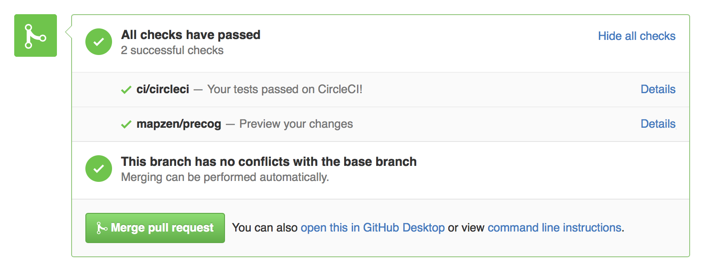

Precog
======

Previously [known as Git-Jekyll Preview](http://github.com/codeforamerica/git-jekyll-preview).

Preview your static websites built with CircleCI before making them live.
Use it to check your plain static or [Jekyll](http://jekyllrb.com/)-generated
websites before you make them live to [Github Pages](http://pages.github.com/)
or to your own server. Requires configured and working
[CircleCI artifacts](https://circleci.com/docs/build-artifacts).

Try it live at [precog.mapzen.com](http://precog.mapzen.com).

Status, Contact
---------------

Precog is mostly a singleton-app, built only to be run at a single
location. For the time being, it's not intended for general redeployment but
improvements for [precog.mapzen.com](http://precog.mapzen.com)
are welcomed.

[Michal Migurski](https://github.com/migurski) is currently maintainer.

Install
-------

The application is a [Flask](http://flask.pocoo.org)-based Python server.
[OAuth](http://developer.github.com/v3/oauth/) is used for authentication;
put your client ID and secret in environment variables `GITHUB_CLIENT_ID`
and `GITHUB_CLIENT_SECRET`, and your CircleCI developer key in `CIRCLECI_TOKEN`.

To run for testing:

    python make-it-so.py

To run in production, with [Gunicorn](http://gunicorn.org):

    gunicorn make-it-so:app

Using Webhooks
--------------

Precog can accept push and pull requests from Github to generate direct links
to commit previews for you, and show them as a successful status check in
Github’s pull request interface:



This must be enabled separately for each repository, and requires a Github
personal access token to write results back to the Github Status API.

1. Generate a [personal access token](https://github.com/settings/tokens) and
   give it a descriptive name like “Precog Status Updates: {repo name}” so
   you can figure out what it is later. Give it `repo` scope access.
   
2. Make a random alphanumeric secret that will be shared between Precog
   and Github’s webhook setting, to ensure that only requests from the right
   repository will be acted on.
   
3. Add or update a configuration setting in  Precog’s environment variables,
   called `WEBHOOK_CONFIG` and containing space-delimited settings for each
   repository Precog should listen for:
   
   ```
   mapzen/blog:xxy:xyx mapzen/styleguide:xyy:yxx {your repo}:{secret}:{token}
   ```
   
   Currently, this must be done by talking to Mike.
   
4. Add a webhook to the Github repository, using the payload URL
   `https://precog.mapzen.com/hook`, the secret from earlier, and the
   `application/json` content type. Send just the Pull Request and Push events.
